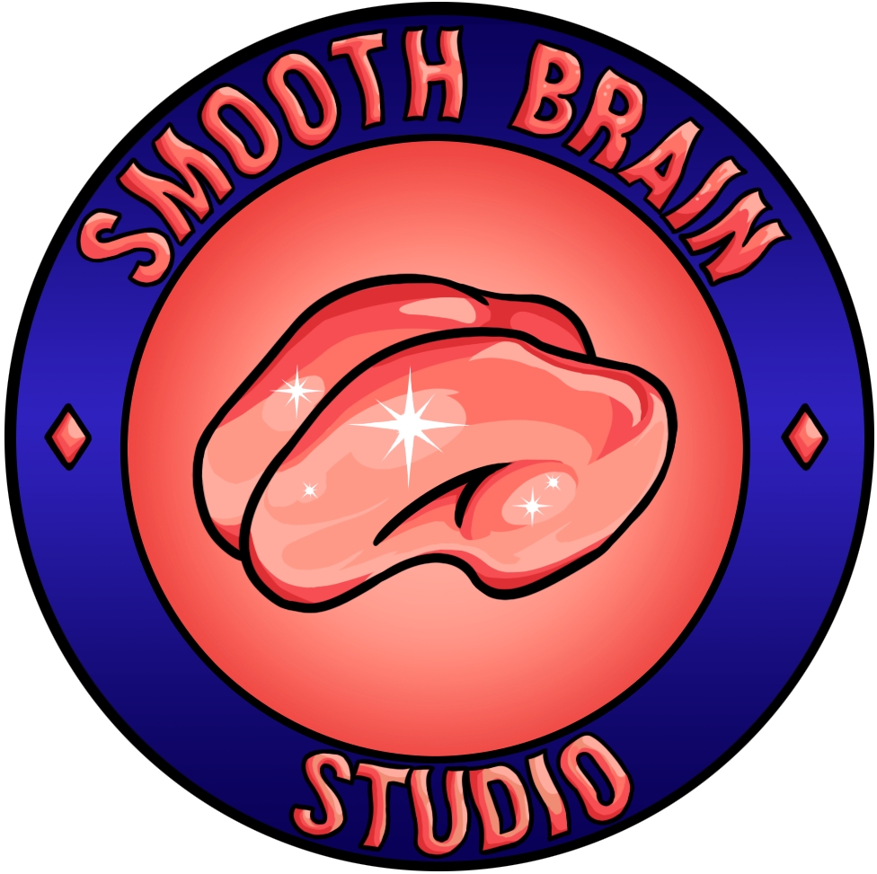

<h1 align="center"> This is the old repository of Netherveil, you can find the new one right here → https://github.com/SmoothBrainStudio/Netherveil </h1>

 
  

<h1 align="center"> Netherveil </h1>
<h3 align="center"> Smooth Brain Studio -2024 Student project </h3>
<h5 align="center"> Rogue like - 30 minutes average session </h5>

 
  

  <a href="https://toraenor.itch.io/netherveil" alt="Our page on itch.io"> Find us on itch.io </a>

  <a href="https://github.com/SmoothBrainStudio" alt="Smooth Brain Studio github page"> More Smooth Brain project </a>

<!-- ABOUT THE PROJECT -->
<h2>About The Project</h2>
<h3> → A corrupted dungeon to conquer </h3>
Make your way deeper and deeper into this dungeon and defeat the corrupted monsters to save the world from corruption!
<h3> → Equip yourself and fight </h3>
Play as a warrior who must defeat the source of evil in the dungeon to save the world from total corruption! Arm yourself with items with all kinds of effects, and choose between the path of blessing or that of corruption to achieve your goals in this randomly generated dungeon!
<h3> → How we made it </h3>
This project was realized on Unity, initially in 9 weeks at a rate of 1 day per week, then 8 weeks full-time with a team of 7 programmers and 4 graphists.

<h2>Software</h2>

| Engine | Graphism | Procedural Generation | Music |
|--------|----------|-----------------------|-------|
| Unity `2022.3.5f1` | Maya3D | Houdini `20.0.547` | None `Royalti free musics` |

<h2>Authors</h2>

- Development : [Dorian Delbos](https://doriandelbos.fr/about)
- Development : [Dunkan Jadras](https://www.linkedin.com/in/dunkan-jadras-73b282256/)
- Development : [Enzo Berti](https://enzoberti.itch.io/)
- Development : Léo Briand
- Development : [Nicolas Romieux](https://www.linkedin.com/in/nicolasromieux/)
- Development : [Olivier Maurin](https://www.linkedin.com/in/olivier-maurin-dev/)
- Development : [Yohann Morits](https://www.linkedin.com/in/yohann-morits/)
- Graphics : [Mattéo Marinaro](https://www.linkedin.com/in/matt%C3%A9o-marinaro-846960143/)
- Graphics : Nicolas Gonzalez
- Graphics : [Nolan Lagache](https://www.linkedin.com/in/nlg2002/)
- Technical artist : [Nathan Guiral](https://www.linkedin.com/in/nathan-guiral-aa7587208/)